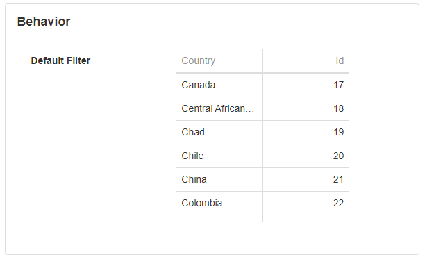
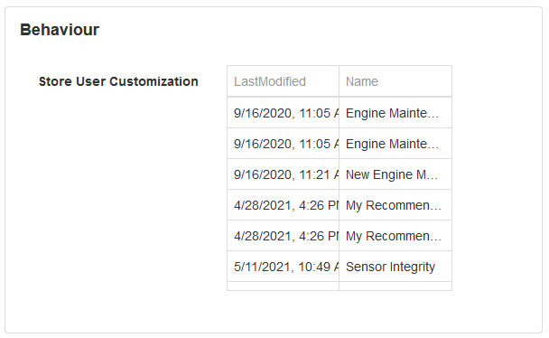
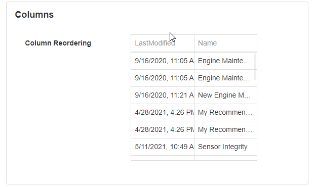
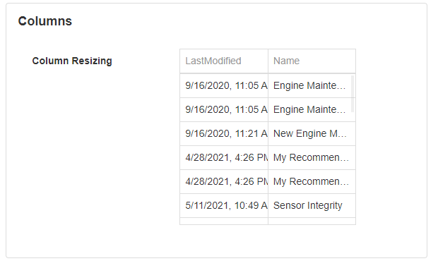

# Data Grid

A Data Grid allows you to display important information to the user in a grid format. This is useful for displaying all records from a database, or a selected number of records from a database.

.png>)

## Data Grid Properties

### Appearance

#### Common Properties

The _visibility_ property is common to most Blocks;

[See the Common Properties article for more details on common appearance properties.](../common-properties.md#appearance)

#### Show Borders

Will show borders around the grid.

.png>)

#### Show Headers

Will show the headers/column title.&#x20;

.png>)

#### Show Column Lines

Will show a vertical line between columns.

.png>)

#### Show Row Lines

Will show a horizontal line between rows.

.png>)

#### Alter Row Color

The background color of the odd rows will be grey.

.png>)

#### Show Column Chooser

Column Chooser button will be displayed and the user has the ability to hide/show columns.

.png>)

#### Enable Paging

The default option is to show all the results. The user can specify how many items should be displayed per page and pages will be displayed under the grid.&#x20;

.png>)

### Behavior

#### Common Properties

The _disabled_ property is common to most Blocks;

[See the Common Properties article for more details on common behavior properties.](../common-properties.md#behavior)

#### Allow Selection

Allows the user to select an item from the grid.

.png>)

#### Allow Multiple Selection

Allows the user to select multiple items from the grid.

#### Allow Adding

Add button will be displayed and the user can add/insert rows by clicking on it.

.png>)

#### Allow Deleting

The delete button will be displayed on the right side of the row.

.png>)

#### Allow Updating

This will enable editing the row by clicking the item.

.png>)

#### Allow Search

This will let you search the grid with the search bar.&#x20;

#### Edit Mode

Grid data can be edited in several modes. Set the Edit Mode property to specify the mode.

| Mode                     | Description                                                                                                                                                                                                                                                                                                                                                  |
| ------------------------ | ------------------------------------------------------------------------------------------------------------------------------------------------------------------------------------------------------------------------------------------------------------------------------------------------------------------------------------------------------------ |
| Batch                    | 
A user edits data cell by cell. Changes are not updated until a user clicks the Save button. In this mode, the "Add" button is found above the grid rather than in the grid's header row, along with the Save and Reset buttons.

                                                       |
| Batch With External Save | 
A user edits data cell by cell. Changes are not updated until a user clicks an external Block (e.g. a Button) with Update Data Sources corresponding to the grid's data source. 

                                                                                                       |
| Cell                     | 
A user edits data cell by cell. Changes are saved once a cell loses focus, or discarded if a user presses Esc.

                                                                                                                                                                          |
| Row                      | 
A user edits data row by row. When a user clicks an "Edit" button in the right-most column, the corresponding row enters the editing state, and the "Save" and "Cancel" buttons appear in the right-most column. Pressing the "Save" button will update your data source immediately.

 |

#### Allow Search

This will show a search bar at the top of the Data Grid.&#x20;

.PNG>)

#### Allow Export to Excel

The export button will be displayed and by clicking it will export the grid into an excel file.

.png>)

#### Enable Column Filtering

This will let you filter the results per column by clicking the filter icon next to the column name.

.png>)

#### Enable Row Filtering

The search bar will be added for each column and the user can search the results.

.png>)

#### Enable Filter Panel

Create Filter button will be displayed and clicking it will open a Filter Builder. If a user changes the filter expression in the Filter Panel the changes are reflected in the Enable Row Filtering and Enable Column Filtering, and vice versa.&#x20;

#### Default Filter

This defines the default filter selected in the Filter Panel. Anyone visiting the page for the first time will have the same filter applied to the Data Grid. For example, every time this Data Grid has loaded records that start with the letter "C" are displayed. The filter will still be applied if the filter panel is disabled, which will prevent the user from changing the filter.

.png>)

#### Allow Grouping

.png>)

#### Auto-Adjust Column Widths

Will try to adjust the width of the column to show results as much as possible.&#x20;

.png>)

#### Store User Customization

Changes made to the grid are saved in the cookies on your browser between page refresh and window changes. This can include column reordering, resizing and applied filters. &#x20;

### Value

#### Common Properties

The _value_ property is common to most Blocks;

[See the Common Properties article for more details on common value properties.](../common-properties.md#behavior-1)

### Data Source

#### Common Properties

Properties that are common to most Blocks include: _filter_, _sort_, _show # of results_, and _skip # of results;_

‌[See the Common Properties article for more details on common Data Source properties.](../common-properties.md#data-source)

The Data Source property is required for the Data Grid.

### Columns

List of all columns from the selected Data Source. Users can reorder or change the _visibility, name, type, alignment, width,_ set it as _read-only, and set the_ Editor type. &#x20;

#### Format

If the Type field is set to Number, you have the option to format the field as default (none), currency, or percentage.&#x20;

.png>)

#### Currency

If the Format field is set to Currency, choose which currency symbol to display.

#### Editor Type - Lookup

The lookup field will only appear when the cell or the row is in edit mode. The Lookup editor type has three configurable properties.&#x20;

The column's value is automatically mapped to the Text property.

For more details about Data Source [see the Common Properties article for more details on common data source properties](data-grid.md#data-source).&#x20;

Display Field is the value of what text will be displayed.

Value Field selection from the new Data Source needs to match the value that is in the cell.

.gif>)

#### Editor Type - Hyperlink

It will show the value in the field as a Hyperlink. The Hyperlink editor type is based on the Hyperlink block. [See the Hyperlink article for more details on how to configure the Hyperlink block](../actions/hyperlink.md#appearance).

The column's value is automatically mapped to the Text property.

#### Editor Type - Indicator

.png>)

The value in the field has to be a valid color format. The indicator editor type is based on the Indicator block with less configurable options. [See the Indicator article for more details on how to configure the Indicator block.](indicator.md#appearance)

The column's value is automatically mapped to the Text property.

#### Open in New Tab/Window

Tick for the URL to open in a new tab/window, instead of redirecting the current tab. This applies when the [Editor Type](data-grid.md#editor-type-hyperlink) is set to 'Hyperlink'.

<!-- unsupported tag removed -->
We recommend opening XMPro URLs in the same tab/window - as users may experience degraded performance when a large number of XMPro tabs are opened.
<!-- unsupported tag removed -->

#### Column Reordering

Reordering columns is possible at runtime and is enabled by default on every Grid. Users can change the order by dragging one column to another position.&#x20;

#### Column Resizing

Resizing columns is possible at runtime and is enabled by default on every Grid. Users can resize the columns by dragging the edge of the column.

### Action

#### Common Properties

Properties that are common to most Blocks include: _Navigate to_ and _Show Confirmation Dialog;_

[See the Common Properties article for more details on common action properties.](../common-properties.md#action)

## Override Grid Values

When saving grid rows to a Data Source, you may want to override some values. For instance, if you want to update a column with the current date and time, or replace a column with a [Parameter](../../concepts/application/navigation-and-parameters.md) or [Variable](../../concepts/application/variables-and-expressions.md#variables).&#x20;

To do this follow these instructions:

1. On the Data Grid, enable the Allow Updating property and set the Edit Mode to Batch With External Save.&#x20;
2. Then, under the Action accordion in the Block Properties of a Button or other Block, click the button with the gear icon of the corresponding Data Source to the Data Grid.&#x20;
3. Press the + button to the right of Override Values, select the column to override, and press Add.
4. In the Value column of Override Values, choose a static or dynamic value.
5. Press Apply on the Update Data Source page, and Save the App Page.

.png>)
