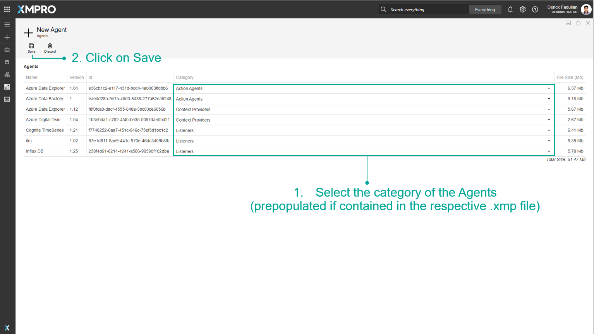
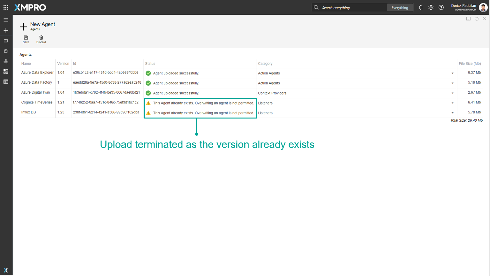

# Manage Agents

Agents create the foundation for Data Streams, and they can be connected to other Agents to create the flow of data. Each Agent performs a specific function. They are useful as they can be used to either retrieve data in real-time, display data, filter or sort the data, or save them to another database, depending on the function of that individual Agent.&#x20;

<!-- unsupported tag removed -->
It is recommended that you read the article listed below to improve your understanding of Agents.

* [Agent](../../concepts/agent/)
<!-- unsupported tag removed -->

## **Creating Agents**

Creating an Agent can be divided into two parts:

### Writing the code for an Agent

Agents are generally written in C# as library projects that make use of the [XMPro.IoT.Framework](https://www.nuget.org/packages/XMPro.IOT.Framework/) NuGet package.

XMPro.IoT.Framework requires your project to be written using a predefined structure. This structure requires you to implement certain interfaces, depending on the type of Agent you are creating.&#x20;

To learn more about how to use this framework, refer to [these](building-agents.md) instructions.

<!-- unsupported tag removed -->
Code for some Agents has been made available on [GitHub.](https://github.com/XMPro/) It might be useful to use these resources as an example when writing your own Agents.
<!-- unsupported tag removed -->

### Packaging the Agent

After writing your code, you need to use the [XMPro Package Manager](https://apps.microsoft.com/store/detail/xmpro-package-manager/9N3F4WNSLGZK?hl=en-us\&gl=us\&activetab=pivot%3Aoverviewtab) Windows 10 desktop application to package your Agent.&#x20;

This application allows you to specify all the properties your Agent requires, add the user settings in the form of controls, and allows you to upload the DLL of the Agent you’ve written. Finally, it will create a file with a “.xmp” extension, which you can upload to Data Stream Designer and start to use to build Streams.&#x20;

To package the Agent, refer to [these](packaging-agents.md) instructions.

## **Adding an Agent**

After writing a new Agent and packaging it, you can upload it to Data Stream Designer by following the steps below:

1. Open the _Agents_ page from the left-hand menu.
2. Click _Add_.
3. Click the _Select File_ button and browse to the _.xmp_ file you’ve packaged.
4. If the ._xmp_ file is valid, some of the details contained in the file, such as the name of the Agent, will automatically be listed on the form.
5. Select the category of the Agent (prepopulated if contained in the file)
6. Click _Save_.

<!-- unsupported tag removed -->
&#x20;The _Metadata_ field allows you to add tags for the Agent. You can either select a value from the drop-down that appears when you click in the field or type a new value and press _Enter_.
<!-- unsupported tag removed -->

.png>)

Additional information that forms part of the Agent’s details will be displayed on the form, such as the version and Metadata.

.png>)

The newly uploaded Agent will now be available in the toolbox on the Use Case canvas page. To add an Agent to the canvas, follow the steps below:

1. Open the Data Streams page from the left-hand menu.
2. Select your Data Stream.

&#x20;   3\. Expand the category in the toolbox where your Agent is located.\
&#x20;   4\. Click on your Agent and drag the Agent to the canvas.\
&#x20;   5\. Click _Save_.

## Bulk Adding Agents

Uploading multiple Agents begins like a [single Agent](manage-agents.md#uploading-an-agent-to-data-stream-designer), except a compressed (.zip) file is selected.&#x20;

<!-- unsupported tag removed -->
A 100 MB limit applies to the decompressed file size, not the compressed one.
<!-- unsupported tag removed -->

If the _.zip_ file is valid, a data grid is populated with the Agent name, version, ID, category, and file size. Complete the upload by following the steps below:

1. Select the category of the Agents (prepopulated if contained in the respective _.xmp_ file)
2. Click on _Save_

If any Agents fail the initial validation due to a missing category, a status column appears to identify them. To fix this, (1) select the category and (2) click on _Save_. Or _Discard_ to exit the blade.

<figure><figcaption></figcaption></figure>

The status column will advise which Agents were uploaded successfully, and which were ignored as the version already exists.&#x20;

## **Upgrading Agents**

To upgrade Agents in the Data Stream, visit [How To Upgrade a Stream Object Version.](../data-streams/upgrade-a-stream-object-version.md)

## **Deleting Agent Versions**

To remove one or more versions of a specific Agent, first, make sure that the versions of the Agent that you’re planning to remove are not being used anymore. Then, open the _Agents_ page from the left-hand menu and follow the steps below:

1. On the Agents page, select the Agent.
2. Click on “_Delete Versions_“.
3. Select the versions you would like to delete.
4. Click _Delete_.

## **Deleting Agents**

When planning to remove multiple Agents completely at the same time, make sure they are not being used anymore. Open the _Agents_ page from the left-hand menu and follow the steps below:

1. &#x20;Click on “_Select_“.
2. Select all the Agents you would like to remove.
3. Click on “_Delete_“.

<!-- unsupported tag removed -->
&#x20;To cancel the selection, click on “_Select_” again.
<!-- unsupported tag removed -->

&#x20;   4\. Confirm that you would like to delete all versions of the selected Agents.

## Finding Help for Agents

Help documentation is available for every Agent. These pages provide context, configuration definitions, an example, and release notes to help if you are unsure of anything related to the Agent you are configuring.&#x20;

[See the Integrations article for the list of Agent documentation links.](https://documentation.xmpro.com/resources/integrations)
